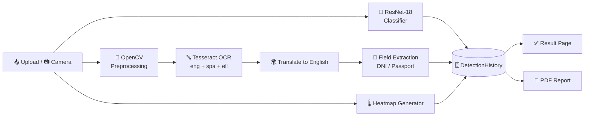

<div align="center">

# 🔍 DocAI

### Document Forgery Detection & Analysis System using OCR and Deep Learning

*Upload a document → get a verdict, evidence, extracted text, a heatmap and a PDF report. All in one place.*


</div>

---

## 📖 About

Banks, universities, employers and government portals all receive documents as scans and phone photos. Checking each one by eye is slow, and a single edited field is easy to miss.

**DocAI** is a web application that puts everything a reviewer needs into one workflow:

- 🧠 a **ResNet-18** classifier that says whether a document looks **GENUINE** or **FORGED**
- 🔤 **multilingual OCR** (English + Spanish + Greek) with automatic **translation to English**
- 🪪 **rule-based field extraction** for Spanish ID cards (DNI) and Greek passports
- 🌡️ a **forensic heatmap** that points the reviewer's eye to the important document regions
- 📄 a downloadable **PDF report**
- 👤 **user accounts** with private analysis history
- 📷 **live camera capture** as well as normal file upload

> ⚠️ DocAI is built to **assist** a human reviewer, not replace one. A high confidence score is **not** legal proof that a document is authentic.

---

## ✨ Features

| | Feature | What it does |
|---|---|---|
| 🧠 | **3-class forgery detection** | Authentic vs. Fraud Class 5 (inpainting / rewriting) vs. Fraud Class 6 (crop / composite) with probabilities for each class |
| 🔤 | **Multilingual OCR** | Tesseract (`eng+spa+ell`) on an OpenCV-cleaned image |
| 🌍 | **Auto translation** | Recognised text is translated into English |
| 🪪 | **Field extraction** | Name, nationality, sex, dates, passport / ID numbers for Spanish DNI & Greek passports |
| 🌡️ | **Forensic heatmap** | Highlights faces, photos, text blocks, signatures, stamps and borders, weighted by the prediction |
| 📄 | **PDF reports** | Generated with ReportLab, ready to archive or share |
| 📷 | **Live camera capture** | Capture, review, then **Retake** or **Use Photo** |
| 🔐 | **Auth & privacy** | Register / login / logout, and every user sees only their own records |
| 🗂️ | **History & stats** | Total, forged and genuine counts per user, with download and delete |
| 🌗 | **Light / Dark theme** | Responsive Tailwind UI |

---

## 🧩 How It Works



**Design choice worth knowing:** OCR runs as a *separate* branch from the classifier. A misread character can never change the GENUINE / FORGED verdict, and if translation fails, the classification result is still saved.

### The three classes

| Model class | Shown to the user | Meaning |
|---|---|---|
| `positive` | ✅ **GENUINE** | Matches authentic documents from the training data |
| `fraud5_inpaint_and_rewrite` | ❌ **FORGED** | Content removed, rebuilt or rewritten |
| `fraud6_crop_and_replace` | ❌ **FORGED** | Cropped, swapped or composite manipulation |

---

## 📊 Results

Reported in the project evaluation (dataset: roughly 33,000 images of Spanish identity documents and Greek passports):

| Metric | Value |
|---|---|
| Overall classification accuracy | **94.6%** |
| Overall F1-score | **93.2%** |
| Precision, Authentic | 96.2% |
| Precision, Fraud Class 5 | 93.8% |
| Precision, Fraud Class 6 | 92.5% |
| Recall, Fraud Class 5 | 91.9% |
| Recall, Fraud Class 6 | 90.7% |
| OCR character accuracy | 95.4% |
| Multilingual OCR word accuracy | 94.1% |
| Translation semantic accuracy | 93.6% |

> These numbers are for the conditions of our evaluation (Spanish ID + Greek passport data). They are **not guaranteed** for other countries, certificates, bank documents or handwritten records.

---

## 🛠️ Tech Stack

| Layer | Technology |
|---|---|
| Language | Python |
| Web framework | Django 5.2 |
| Deep learning | PyTorch, torchvision (ResNet-18, transfer learning from ImageNet) |
| Image processing | OpenCV, Pillow, NumPy |
| OCR | Tesseract + pytesseract |
| Translation | deep-translator |
| Heatmap rendering | Matplotlib |
| PDF reports | ReportLab |
| Frontend | Django Templates + Tailwind CSS (django-tailwind) |
| Database | SQLite (default) |

---

## 📁 Project Structure

```
DocAi-main/
├── DocAi/
│   ├── manage.py
│   ├── requirements.txt
│   ├── Procfile.tailwind
│   ├── DocAi/                  # Project config
│   │   ├── settings.py
│   │   ├── urls.py
│   │   └── views.py            # Home, auth, profile, features, help
│   ├── detection/              # Core app
│   │   ├── forgery_detector.py # ResNet-18, OCR, translation, fields, PDF
│   │   ├── models.py           # DetectionHistory
│   │   ├── views.py            # Upload, history, download, delete
│   │   ├── urls.py
│   │   └── tests.py            # Includes user-isolation tests
│   ├── ml_models/
│   │   ├── best_multiclass.pt  # Trained weights
│   │   └── class_indices.json  # Class mapping
│   └── theme/                  # Tailwind theme + HTML templates
├── T1.jpg … T4.jpg             # Sample test documents
└── README.md
```

---

## 🚀 Getting Started

### ✅ Prerequisites

| Requirement | Notes |
|---|---|
| **Python 3.10+** | Check with `python --version` |
| **Git** | To clone the repo |
| **Tesseract OCR** | Needs the **English, Spanish and Greek** language data (see Step 3) |
| **Node.js** *(optional)* | Only if you want to rebuild Tailwind CSS. The compiled CSS is already included |
| 8 GB RAM minimum | 16 GB preferred. A CUDA GPU is optional, CPU works fine |

### 1️⃣ Clone the repository

```bash
git clone https://github.com/yashutkhede07-blip/DocAI>/DocAi.git
cd DocAi/DocAi
```

> The folder that contains `manage.py` is the one you work from.

### 2️⃣ Create and activate a virtual environment

**Windows (PowerShell)**
```powershell
python -m venv venv
venv\Scripts\activate
```

**macOS / Linux**
```bash
python3 -m venv venv
source venv/bin/activate
```

Your prompt should now start with `(venv)`.

### 3️⃣ Install Tesseract OCR

**Windows:** download the installer from the [UB-Mannheim Tesseract page](https://github.com/UB-Mannheim/tesseract/wiki). During setup, open **Additional language data** and tick **Spanish** and **Greek**.

**Ubuntu / Debian**
```bash
sudo apt install tesseract-ocr tesseract-ocr-spa tesseract-ocr-ell
```

**macOS**
```bash
brew install tesseract tesseract-lang
```

Then check the Tesseract path in `detection/forgery_detector.py`. It is set to the default Windows location:

```python
pytesseract.pytesseract.tesseract_cmd = r"C:\Program Files\Tesseract-OCR\tesseract.exe"
```

Change it if you installed Tesseract somewhere else. On Linux / macOS, point it to `tesseract` (or remove the line if it is already on your `PATH`).

### 4️⃣ Install dependencies

```bash
pip install --upgrade pip
pip install -r requirements.txt
```

If `requirements.txt` is missing, create it with:

```txt
Django>=4.2
torch>=2.0.0
torchvision>=0.15.0
numpy>=1.24.0
Pillow>=9.0.0
opencv-python>=4.7.0.72
pytesseract>=0.3.10
deep-translator>=1.10.1
reportlab>=4.0.0
django-tailwind>=3.0.0
python-dotenv>=1.0.0
typing-extensions>=4.0.0
matplotlib>=3.7.2
seaborn>=0.12.2
```

### 5️⃣ Set up the database

```bash
python manage.py makemigrations
python manage.py migrate
```

### 6️⃣ Create an admin user

```bash
python manage.py createsuperuser
```

### 7️⃣ Run the server

```bash
python manage.py runserver
```

Open **http://127.0.0.1:8000/** 🎉

### 8️⃣ Try it out

1. Register a new account (or log in).
2. Go to the **Upload** page.
3. Upload a Spanish ID card or Greek passport image (or use the live camera).
4. See the verdict, class probabilities, OCR text, translation, extracted fields and heatmap.
5. Download the **PDF report** from the result or history page.

---

## 🎨 Tailwind CSS (optional)

The compiled stylesheet is already in `theme/static/css/dist/styles.css`, so the app runs without Node.js. To edit the styles:

```bash
python manage.py tailwind install
python manage.py tailwind start
```

If npm is not found, update `NPM_BIN_PATH` in `DocAi/settings.py` to match your system.

---

## 🧪 Running Tests

```bash
python manage.py test
```

The test suite includes checks that one user cannot view, download or delete another user's analysis records.

---

## 🔗 Main Routes

| URL | Page |
|---|---|
| `/` | Landing page |
| `/register/` · `/login/` | Account creation and login |
| `/detection/upload/` | Upload or capture a document |
| `/detection/history/` | Analysis history and statistics |
| `/profile/` | User profile |
| `/features/` · `/help/` | Features and help |
| `/admin/` | Django admin |

---

## 🩹 Troubleshooting

| Problem | Fix |
|---|---|
| `venv\script\activate` not found | Use `venv\Scripts\activate` (capital **S**, plural) |
| `requirement.txt` not found | Rename the file to `requirements.txt` |
| `TesseractNotFoundError` | Install Tesseract and fix `tesseract_cmd` in `forgery_detector.py` |
| OCR returns empty or garbage text | Make sure the `spa` and `ell` language packs are installed |
| Translation is empty | Translation needs an internet connection. OCR and classification still work without it |
| Model file not found | Check that `ml_models/best_multiclass.pt` and `class_indices.json` exist |
| `torch` install is slow or fails | Use the install command from [pytorch.org](https://pytorch.org/get-started/locally/) for your system |

---

## ⚠️ Limitations

Being honest about this:

- The model is trained on **Spanish ID documents and Greek passports**. Other document types will not give the same accuracy.
- The heatmap is a **content-aware inspection map** (faces, photos, text, stamps, borders). It is **not** a Grad-CAM or neural attribution map.
- OCR quality drops on blurry, skewed or low-contrast images.
- Translation sends extracted text to an external service. Do not use real identity documents on a public deployment without stronger privacy controls.
- This is a student prototype and not a certified forensic tool.

## 🔮 Future Scope

- 📚 More document families, languages and manipulation types
- 🔥 Real **Grad-CAM** explanations linked to the classifier
- 🔁 Siamese network for comparison against a trusted reference template
- 📐 Image quality gate (blur, glare, skew) and automatic document edge detection
- 🔒 Offline, privacy-preserving translation

---

## 👥 Team

<div align="center">

| Name | Role |
|---|---|
| **Yash P. Utkhede** | Team Member |
| **Arya N. Mune** | Team Member |
| **Shantanu P. Borkar** | Team Member |
| **Sai V. Shaniware** | Team Member |

**Under the guidance of:** Prof. Ashwini Mahajan

</div>

## 🎓 Academic Details

- **Degree:** Bachelor of Technology, Computer Science & Engineering
- **College:** Tulsiramji Gaikwad-Patil College of Engineering & Technology (TGPCET), Nagpur
- **University:** Rashtrasant Tukadoji Maharaj Nagpur University (RTMNU), Nagpur
- **Session:** 2026-27

---

## 📚 References

1. K. He et al., *Deep Residual Learning for Image Recognition* (ResNet).
2. R. Smith, *An Overview of the Tesseract OCR Engine*.
3. G. Koch et al., *Siamese Neural Networks for One-shot Image Recognition*.
4. B. Bayar and M. Stamm, *A Deep Learning Approach to Universal Image Manipulation Detection*.

Full list of references is in the project thesis.

---

<div align="center">

### ⭐ If this project helped you, drop a star on the repo!

Made with ❤️ and a lot of ☕ at **TGPCET, Nagpur**

</div>
